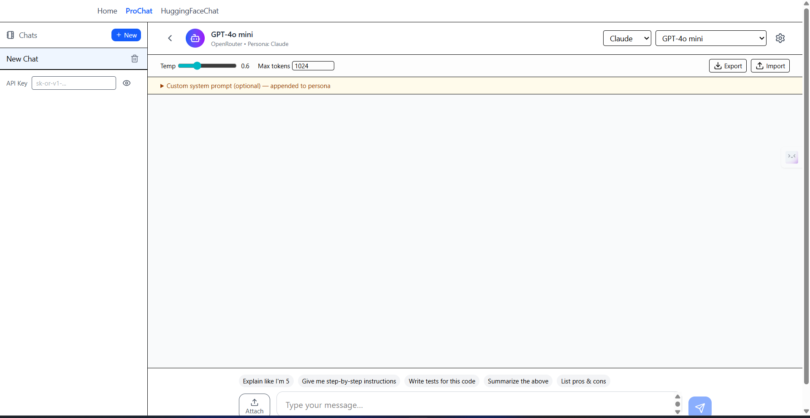
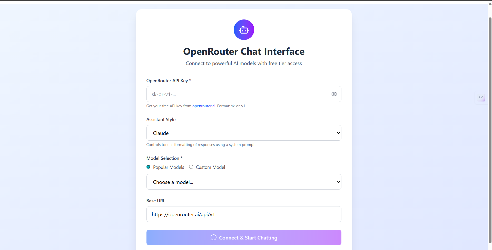

# 🤖 Modern Multi-Model Chatbot

A **next-gen React chatbot** that lets you connect to **any LLM provider** (OpenAI, Anthropic, Qwen, HuggingFace, Meta, etc.) via [OpenRouter](https://openrouter.ai).

---

## ✨ Features

- 🔄 **Multi-model support** – easily switch between GPT, Claude, Qwen, Llama, Gemma, and more  
- ⚡ **Streaming responses** with live typing effect + stop button  
- 🧑‍🎨 **Persona styles** (ChatGPT, Claude, Qwen, Default, or custom system prompt)  
- 📂 **File & image uploads** for multimodal input (works with vision-capable models)  
- 📝 **Edit & regenerate** messages, or restart from any point  
- 📑 **Multi-chat history** with local persistence  
- ⌨️ **Slash commands & quick prompts** (`/clear`, `/summarize`, “Explain like I’m 5”)  
- 📦 **Export / Import chats** as JSON  
- 🎨 **Markdown rendering** with syntax-highlighted code blocks  
- 🌐 **Deployable** to GitHub Pages, Vercel, Netlify, or Cloudflare Pages  

🚀 Perfect for developers who want a **flexible, modern AI chat UI** that looks and feels like ChatGPT, Claude, or Cursor — with full control over models, prompts, and settings.


## 📸 Screenshots




# React + TypeScript + Vite

This template provides a minimal setup to get React working in Vite with HMR and some ESLint rules.

Currently, two official plugins are available:

- [@vitejs/plugin-react](https://github.com/vitejs/vite-plugin-react/blob/main/packages/plugin-react) uses [Babel](https://babeljs.io/) for Fast Refresh
- [@vitejs/plugin-react-swc](https://github.com/vitejs/vite-plugin-react/blob/main/packages/plugin-react-swc) uses [SWC](https://swc.rs/) for Fast Refresh

## Expanding the ESLint configuration

If you are developing a production application, we recommend updating the configuration to enable type-aware lint rules:

```js
export default tseslint.config([
  globalIgnores(['dist']),
  {
    files: ['**/*.{ts,tsx}'],
    extends: [
      // Other configs...

      // Remove tseslint.configs.recommended and replace with this
      ...tseslint.configs.recommendedTypeChecked,
      // Alternatively, use this for stricter rules
      ...tseslint.configs.strictTypeChecked,
      // Optionally, add this for stylistic rules
      ...tseslint.configs.stylisticTypeChecked,

      // Other configs...
    ],
    languageOptions: {
      parserOptions: {
        project: ['./tsconfig.node.json', './tsconfig.app.json'],
        tsconfigRootDir: import.meta.dirname,
      },
      // other options...
    },
  },
])
```

You can also install [eslint-plugin-react-x](https://github.com/Rel1cx/eslint-react/tree/main/packages/plugins/eslint-plugin-react-x) and [eslint-plugin-react-dom](https://github.com/Rel1cx/eslint-react/tree/main/packages/plugins/eslint-plugin-react-dom) for React-specific lint rules:

```js
// eslint.config.js
import reactX from 'eslint-plugin-react-x'
import reactDom from 'eslint-plugin-react-dom'

export default tseslint.config([
  globalIgnores(['dist']),
  {
    files: ['**/*.{ts,tsx}'],
    extends: [
      // Other configs...
      // Enable lint rules for React
      reactX.configs['recommended-typescript'],
      // Enable lint rules for React DOM
      reactDom.configs.recommended,
    ],
    languageOptions: {
      parserOptions: {
        project: ['./tsconfig.node.json', './tsconfig.app.json'],
        tsconfigRootDir: import.meta.dirname,
      },
      // other options...
    },
  },
])
```
